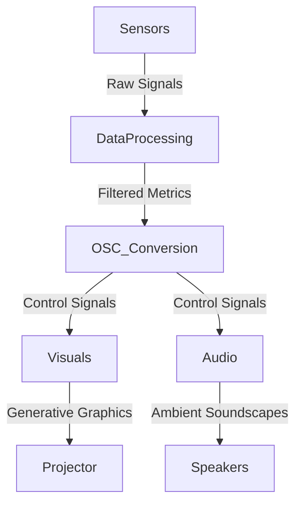
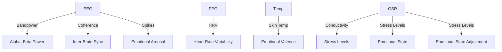
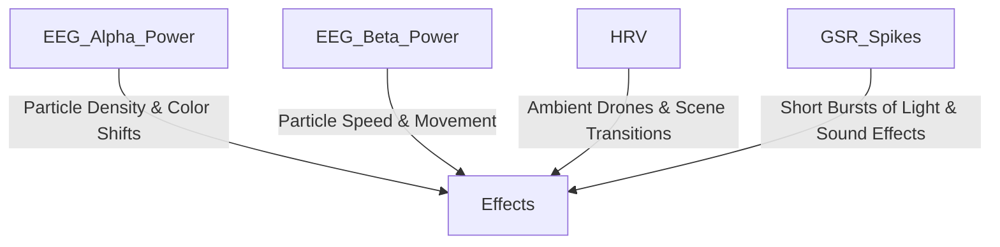

# 🚀 RESI: Rendered Embodiment of Social Interaction

🎭 **An immersive neurofeedback-driven interactive installation** where real-time biometric data by two participants at a time fuels **generative audiovisual experiences**. Using EEG, PPG, GSR, and temperature sensors, RESI transforms human physiological states into **soundscapes, visuals, and interactive elements**, bridging neuroscience, art, and technology.

---

## ✨ Project Overview

🔹 **Real-Time Neurofeedback**: Participants' brain activity, heart rate variability, and skin conductivity directly influence the audiovisual environment.  
🔹 **Multi-Sensory Immersion**: Live projections, spatial audio, and adaptive lighting create a responsive, interactive space.  
🔹 **Collaborative & Mindful**: Participants influence each other’s experiences through **inter-brain synchrony** and biometric data correlation.  
🔹 **Dynamic Visualizations**: Immersive graphics that evolve with the synchrony between participants' signals, i.e. **emotional states, attention levels, and physiological responses**.  
🔹 **Multi-Sensory Immersion**: Spatial audio, projection mapping, and adaptive lighting respond to the participants' brain activity and the quality of their social interaction.  
🔹 **Dynamic Visualizations**: Immersive graphics that evolve with the synchrony between participants' signals, i.e. **emotional states, attention levels, and physiological responses**.

RESI is designed to encourage participants to engage in a meaningful and authentic interaction with each other, as the quality of their interaction directly influences the audio-visual experience they have together. With RESI, we create a space for participants to reflect on the nature of human interaction and the role of social connections in shaping our experiences and perceptions of the world. By encouraging self-awareness and connection, the installation aims to foster a deeper understanding of our shared humanity.

### 🎨 **Inspired by**

🔹 **Neural Aesthetics**: Explore the beauty of brainwaves and biometric signals
🔹 **Human Connection**: Articulating shared experiences through physiological interaction
🔹 **Interactive Art**: Engaging audiences in a dialogue with technology and self

---

## 🧠 How It Works

1️⃣ **Sensors Capture Data**

- EEG, PPG, GSR, and temperature readings are acquired via OpenBCI and additional biosensors.  
  2️⃣ **Processing & Analysis**
- Data is streamed in real-time using LabstreamingLayer (LSL), processed for **bandpower, coherence, HRV, and emotional states**.  
  3️⃣ **Mapping to OSC/MIDI**
- Biometric data is transformed into control signals for generative audiovisual systems in **Max/MSP, Unity, or custom shaders**.  
  4️⃣ **Real-Time Audiovisual Synthesis**
- Brainwaves shape particles, heart rate drives bass pulses, and skin conductivity sparks light bursts.

---

## 🔧 Hardware & Software Stack

### 💾 **Hardware**

- OpenBCI Cyton (8-16 channel EEG)
- PPG sensors
- GSR sensors
- Temperature sensors
- Spatialized speaker system & projection mapping

### 🖥 **Software**

- **Arduino IoT Cloud**: Sensor data aggregation
- **OpenSoundControl (OSC)**: Control signal transmission
- **LabstreamingLayer (LSL)**: Real-time biosignal streaming
- **Max/MSP / Ableton Live**: Sound synthesis & modulation
- **Unity / TouchDesigner**: Generative visuals & interaction
- **OpenBCI GUI**: EEG signal processing & visualization

---

## 🎛️ System Architecture

### 📡 **Data Flow**



### 🧬 **Biometric Data Processing**



### 🎨 **Audiovisual Effects Mapping**



---

## 🎨 Audiovisual Mapping

| Biometric Data                  | Visual Effects               | Audio Effects           |
| ------------------------------- | ---------------------------- | ----------------------- |
| EEG Alpha Power (8–12Hz)        | Wave patterns, color shifts  | Reverb, drone harmonics |
| EEG Beta Power (12–30Hz)        | Rapid particle movement      | Percussion modulations  |
| HRV (Heart Rate Variability)    | Scene transitions            | Ambient pulses          |
| GSR Spikes (Emotional Arousal)  | Light bursts, glitch effects | Distorted textures      |
| Temperature (Emotional Valence) | Color temperature shifts     | Harmonic shifts         |

---

## 🏗️ Installation & Setup

🚀 Setting up your own RESI experience? Follow the guide in Installation_Environment_Setup.md for:
✅ Projector & speaker positioning
✅ EEG & biometric sensor placement
✅ Acoustic & lighting recommendations

---

## 🛠️ Development Workflow

👨‍💻 Want to contribute? Here’s the workflow:

Clone the repo:

```sh
git clone https://github.com/JoshPattani/ReSi_Rendered-Embodiment-of-Social-Interactions.git
cd ReSi_Rendered-Embodiment-of-Social-Interactions
```

Set up your Python environment:

```sh
pip install -r requirements.txt
```

Run the data pipeline:

```sh
python main.py
```

Launch OpenBCI GUI and start streaming data.
Open Max/MSP, Unity, or Ableton Live and connect to OSC signals.

---

## 🤯 Future Enhancements

🔮 Complexity of EEG synchrony mapping
🔮 AI-driven emotional state prediction
🔮 Expanded sensor suite (ECG, EDA, motion tracking)
🔮 Haptic feedback integration

---

#💡 Credits & Inspiration
🚀 Developed by: Cass Bliss, Josh Pattani, and Jazlin Rodriguez
🔗 Related Projects: OpenBCI, Biofeedback VR, generative audiovisual synthesis

---

🙌 Pull requests & collaborations welcome!
