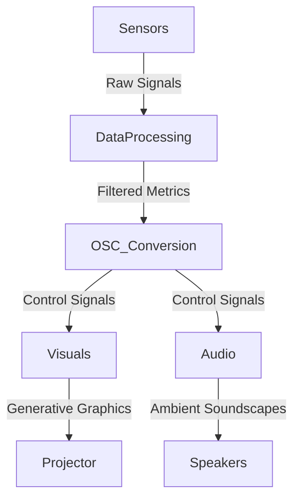
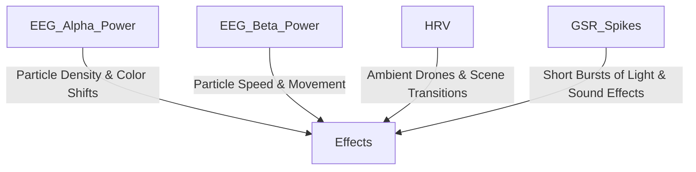
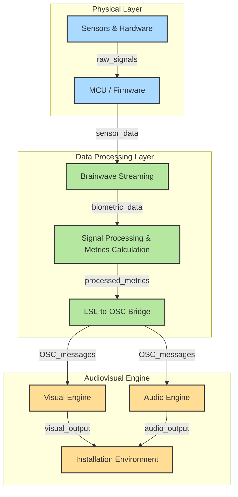

# 🚀 RESI: Rendered Embodiment of Social Interaction

🎭 **An immersive neurofeedback-driven interactive installation** where real-time biometric data by two participants at a time fuels **generative audiovisual experiences**. Using EEG, PPG, GSR, and temperature sensors, RESI transforms human physiological states into **soundscapes, visuals, and interactive elements**, bridging neuroscience, art, and technology.

---

## ✨ Project Overview

🔹 **Real-Time Neurofeedback**: Participants' brain activity, heart rate variability, and skin conductivity directly influence the audiovisual environment.  
🔹 **Multi-Sensory Immersion**: Live projections, spatial audio, and adaptive lighting create a responsive, interactive space.  
🔹 **Collaborative & Mindful**: Participants influence each other’s experiences through **inter-brain synchrony** and biometric data correlation.  
🔹 **Dynamic Visualizations**: Immersive graphics that evolve with the synchrony between participants' signals, i.e. **emotional states, attention levels, and physiological responses**.  
🔹 **Multi-Sensory Immersion**: Spatial audio, projection mapping, and adaptive lighting respond to the participants' brain activity and the quality of their social interaction.  
🔹 **Dynamic Visualizations**: Immersive graphics that evolve with the synchrony between participants' signals, i.e. **emotional states, attention levels, and physiological responses**.

RESI is designed to encourage participants to engage in a meaningful and authentic interaction with each other, as the quality of their interaction directly influences the audio-visual experience they have together. With RESI, we create a space for participants to reflect on the nature of human interaction and the role of social connections in shaping our experiences and perceptions of the world. By encouraging self-awareness and connection, the installation aims to foster a deeper understanding of our shared humanity.

### 🎨 **Inspired by**

- **Neural Aesthetics**: Explore the beauty of brainwaves and biometric signals.
- **Human Connection**: Articulating shared experiences through physiological interaction.
- **Interactive Art**: Engaging audiences in a dialogue with technology and self.

---

## 🧠 How It Works

1️⃣ **Sensors Capture Data**

- EEG, PPG, GSR, and temperature readings are acquired via OpenBCI and additional biosensors.

2️⃣ **Processing & Analysis**

- Data is streamed in real-time using LabstreamingLayer (LSL) and Open Sound Control (OSC), processed for **bandpower, coherence, HRV, and emotional states**.

3️⃣ **Mapping to OSC/MIDI**

- Biometric data is transformed into control signals for generative audiovisual systems in **Max/MSP, or similar visual programming environments**.

4️⃣ **Real-Time Audiovisual Synthesis**

- Brainwaves influence movement of particles, heart rate drives light and sound pulses, and skin conductivity effects color of the particle systems.

---

## 🔧 Hardware & Software Stack

### 💾 **Hardware**

- OpenBCI Cyton bio-sensing boards (8-16 channel EEG)
- PPG sensors
- GSR sensors
- High-fidelity speakers (at least 2 channels, 5.1 surround recommended)
- Projector (minimum 1080p resolution, 4K recommended), short-throw lens may be required depending on space

### 🖥 **Software**

- **PlatformIO**: Sensor data aggregation for Arduino
- **Python 3.12**: Data processing & streaming
- **OpenSoundControl (OSC)**: Control signal transmission
- **LabstreamingLayer (LSL)**: Real-time biosignal streaming
- **Max/MSP / Ableton Live**: Sound synthesis & modulation
- **Max/MSP 9 / TouchDesigner**: Generative visuals & interaction
- **OpenBCI GUI**: EEG signal processing & visualization

---

## 🎛️ System Architecture

### 📡 **Data Flow**



### 🧬 **Biometric Data Processing**

```mermaid
flowchart TD
    PPGS(PPG Sensor) --> HR(Heart Rate BPM)
    PPGS --> HRV(Heart Rate Variability RMSSD)

    HR --> HRL(Low: 40-60 BPM)
    HRL --> HRLN(Deep Relaxation/Sleep)

    HR --> HRM(Mid: 60-80 BPM)
    HRM --> HRMN(Resting, Normal State)

    HR --> HRUM(Upper Mid: 80-100 BPM)
    HRUM --> HRUMN(Mild Stress, Cognitive Effort)

    HR --> HRH(High: 100+ BPM)
    HRH --> HRHN(High Stress/Physical Exertion)

    HRV --> HRVL(Low: <20ms)
    HRVL --> HRVLN(Chronic Stress, Fatigue)

    HRV --> HRVLM(20-40ms)
    HRVLM --> HRVLMN(Moderate Stress, Cognitive Effort)

    HRV --> HRVM(40-60ms)
    HRVM --> HRVMN(Normal Balance, Healthy)

    HRV --> HRVUM(60-100ms)
    HRVUM --> HRVUMN(Relaxed, Parasympathetic)

    HRV --> HRVH(>100ms)
    HRVH --> HRVHN(Deep Relaxation, Sleep)

    EEG(EEG Cyton) --> BP(Band Powers)
    BP --> Delta(Delta 0.5-4Hz)
    BP --> Theta(Theta 4-8Hz)
    BP --> Alpha(Alpha 8-12Hz)
    BP --> Beta(Beta 12-30Hz)

    Delta --> DL(Low: <10)
    DL --> DLN(Fully Awake, Alert)

    Delta --> DML(10-50)
    DML --> DMLN(Light Relaxation, Drowsy)

    Delta --> DM(50-200)
    DM --> DMN(Deep Sleep, Unconscious)

    Delta --> DH(>200)
    DH --> DHN(Very Deep Sleep, Pathological)

    Theta --> TL(Low: <5)
    TL --> TLN(High Focus, External Attention)

    Theta --> TML(5-20)
    TML --> TMLN(Relaxed Alertness, Creativity)

    Theta --> TM(20-50)
    TM --> TMN(Drowsiness, Inward Focus)

    Theta --> TH(>50)
    TH --> THN(Deep Meditation, Early Sleep)

    Alpha --> AL(Low: <10)
    AL --> ALN(High Stress, Overactive Mind)

    Alpha --> AML(10-30)
    AML --> AMLN(Relaxed but Alert, Idle)

    Alpha --> AM(30-50)
    AM --> AMN(Deep Relaxation, Meditation)

    Alpha --> AH(>50)
    AH --> AHN(Over-relaxation, Drowsiness)

    Beta --> BL(Low: <5)
    BL --> BLN(Deep Relaxation, Disengagement)

    Beta --> BML(5-15)
    BML --> BMLN(Calm, Focus, Normal Thinking)

    Beta --> BM(15-30)
    BM --> BMN(Problem-solving, Active Effort)

    Beta --> BH(>30)
    BH --> BHN(High Stress, Anxiety, Overload)
```



### 🎨 **Audiovisual Effects Mapping**



---

## 🎨 Audiovisual Mapping

| Biometric Data                  | Visual Effects               | Audio Effects           |
| ------------------------------- | ---------------------------- | ----------------------- |
| EEG Alpha Power (8–12Hz)        | Wave patterns, color shifts  | Reverb, drone harmonics |
| EEG Beta Power (12–30Hz)        | Rapid particle movement      | Percussion modulations  |
| HRV (Heart Rate Variability)    | Scene transitions            | Ambient pulses          |
| GSR Spikes (Emotional Arousal)  | Light bursts, glitch effects | Distorted textures      |
| Temperature (Emotional Valence) | Color temperature shifts     | Harmonic shifts         |

---

## 📘 System Overview

The complete system consists of:

1. **Brainwave Streaming** - Collects EEG data from two OpenBCI Cyton boards simultaneously
2. **LSL to OSC Bridge** - Converts Lab Streaming Layer (LSL) data to Open Sound Control (OSC) messages
3. **Biometric Sensors** - Arduino/ESP32-based PPG and GSR sensors for additional physiological measurements



## 🔌 Installation

Each component has its own installation instructions. See the README files in each subdirectory:

- [Dual OpenBCI Streaming](./brainwaveStreaming/brainflow-duo-lsl/README.md)
- [LSL to OSC Bridge](./brainwaveStreaming/lsl-to-osc-bridge/README.md)
- [PPG Sensor](./MCU_code/PlatformIO/PPG-sensor_Final/README.md)
- [GSR Sensor](./MCU_code/PlatformIO/GSR-sensor_Final/README.md)

## Quick Start

1. Set up and connect your OpenBCI boards with the Cyton dongle
2. Configure your YAML settings files for each board
3. Start the dual streaming script
4. Start the LSL-to-OSC bridge
5. Connect the PPG and GSR sensors to participants
6. Launch your visualization or data collection software

For detailed step-by-step instructions, see the README files in each component folder.

## Project Structure

ReSi_Rendered-Embodiment-of-Social-Interactions/
├── brainwaveStreaming/
│ ├── brainflow-duo-lsl/ # Dual OpenBCI streaming
│ ├── lsl-to-osc-bridge/ # Converts LSL to OSC
│ └── openbci-brainflow-lsl-master/ # Single board reference
└── MCU_code/
└── PlatformIO/
├── GSR-sensor_Final/ # Galvanic Skin Response sensor
└── PPG-sensor_Final/ # Photoplethysmography (pulse) sensor

---

## 🏗️ Physical Environment & Setup

🚀 Setting up your own RESI experience? Follow the guide in Installation_Environment_Setup.md for:

- ✅ Projector & speaker positioning
- ✅ EEG & biometric sensor placement
- ✅ Acoustic & lighting recommendations

---

## 🛠️ Development Workflow

👨‍💻 Want to contribute? Here’s the workflow:

Clone the repo:

```sh
git clone https://github.com/JoshPattani/ReSi_Rendered-Embodiment-of-Social-Interactions.git
cd ReSi_Rendered-Embodiment-of-Social-Interactions
```

Set up your Python environment:

```sh
python -m venv .venv

```

Activate the virtual environment:

```sh
source .venv/bin/activate  # On macOS/Linux
.venv\Scripts\activate     # On Windows
```

Install the required packages:

```sh
pip install -r requirements.txt
```

Run the data pipeline:

```sh
python main.py
```

Launch OpenBCI GUI and start streaming data.
Open Max/MSP, Unity, or Ableton Live and connect to OSC signals.

---

## 🤯 Future Enhancements

- 🔮 Complexity of EEG synchrony mapping
- 🔮 AI-driven emotional state prediction
- 🔮 Expanded sensor suite (ECG, EDA, motion tracking)
- 🔮 Haptic feedback integration

---

## 💡 Credits & Inspiration

### 🚀 Developed by: Cass Bliss, Josh Pattani, and Jazlin Rodriguez

### 🎥 Visual Design & Artistic Direction: Cass Bliss

### 🧠 Bio-sensing System Design & Development: Josh Pattani

### 🎹 Audio Design & Interaction: Jazlin Rodriguez

---

## 📚 References & Resources

- 📖 [OpenBCI Cyton User Manual](https://docs.openbci.com/Cyton/CytonLanding/)
- 📖 [LabstreamingLayer (LSL) Documentation](https://labstreaminglayer.readthedocs.io/)
- 📖 [Brainflow Documentation](https://brainflow.readthedocs.io/en/stable/index.html)
- 📖 [MNE-LSL Documentation](https://mne.tools/mne-lsl/stable/index.html)
- 📖 [Max/MSP Documentation](https://docs.cycling74.com/max8)

---

## 📅 Upcoming Events

- 🎤 Workshops and demos happening in 2025
- 📚 Publications and papers related to the project
- 🛠️ User feedback sessions on system enhancements

---

## 🌟 Community Contributions

- 🤝 Join our community discussions on project ideas and improvements.
- 💬 Share your experiences and feedback to enhance RESI.

---

🙌 Pull requests & collaborations welcome!
